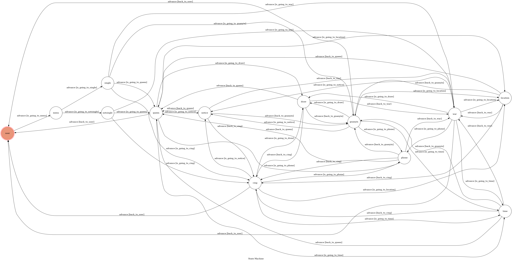
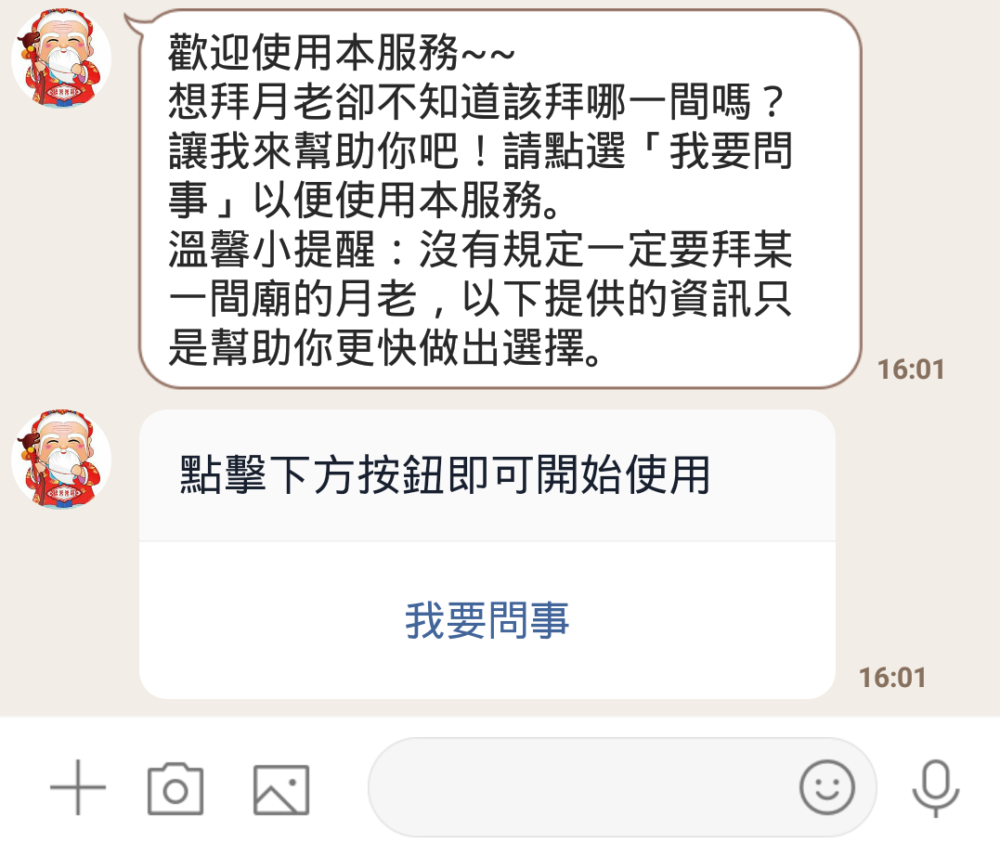
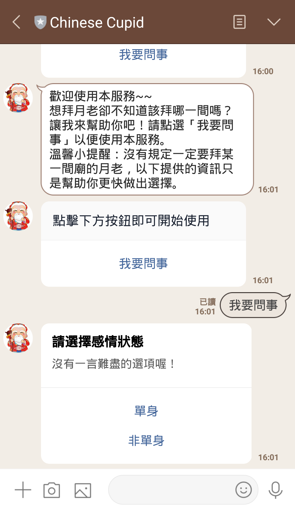
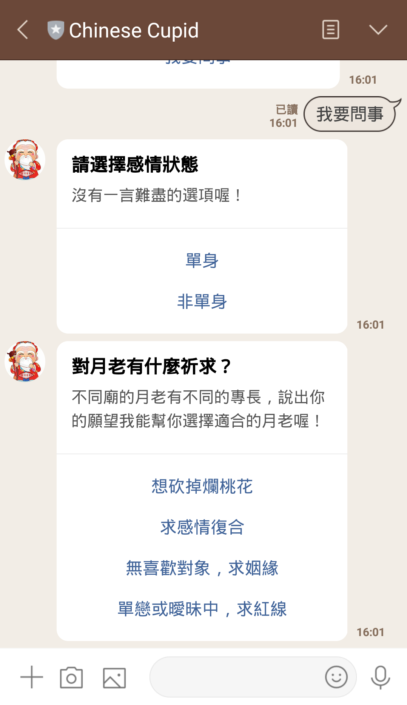
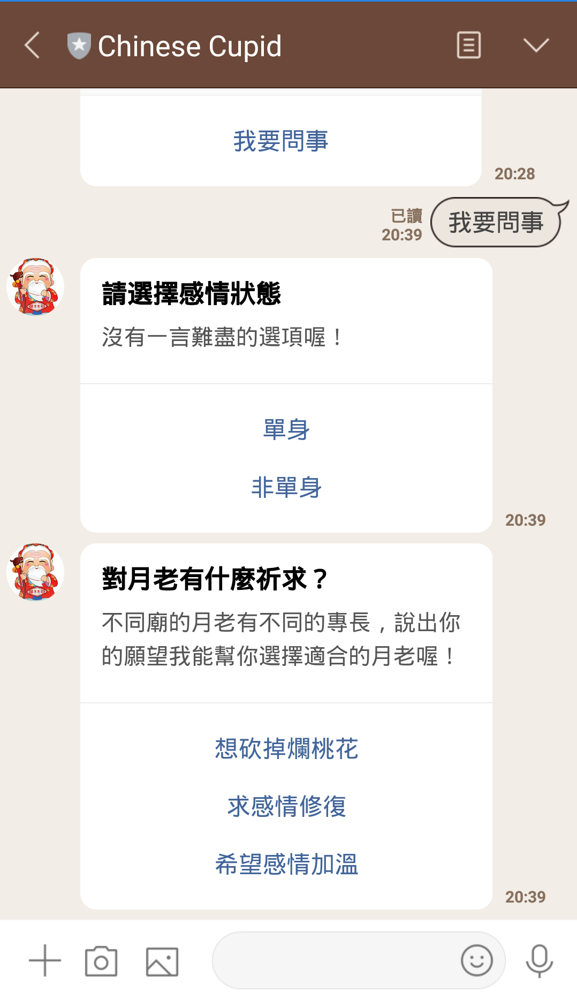
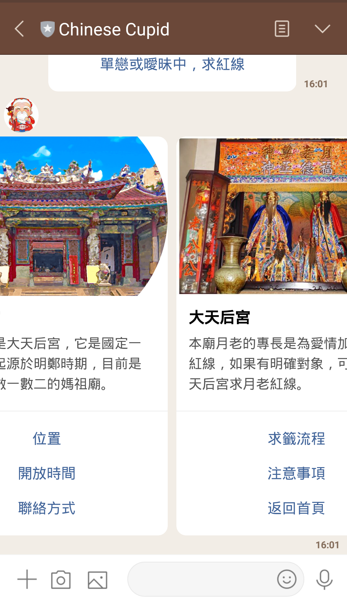
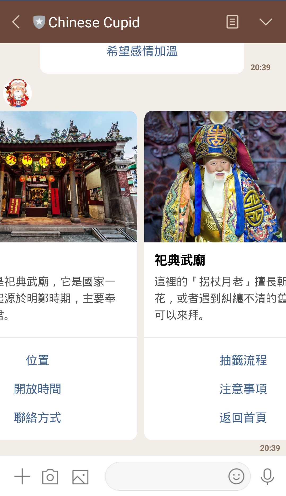
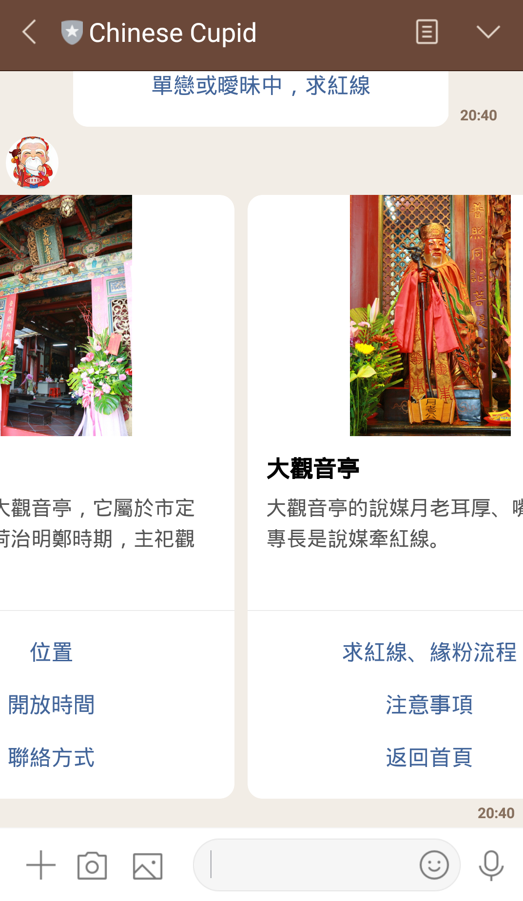
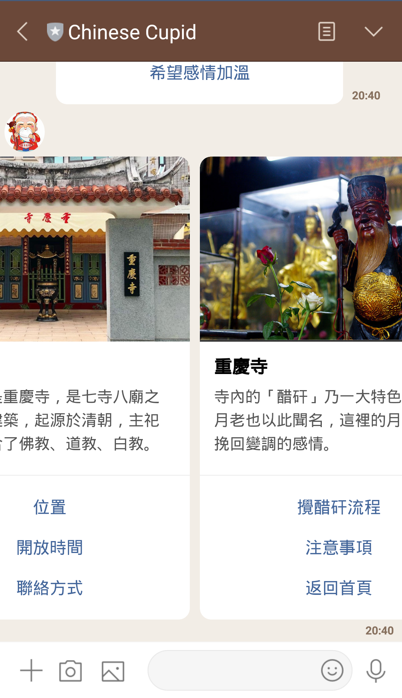
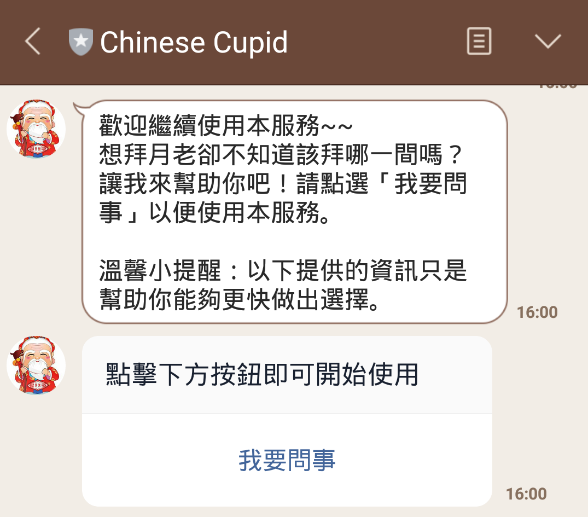

# Chinese cupid
## 說明
這個聊天機器人可以幫助你找到適合的月老

目前只有收錄府城四大月老，四大月老分別是大天后宮、祀典武廟、大觀音亭和重慶寺的月老

## 功能

#### 找出適合使用者的月老

* bot藉由詢問兩個問題來找出適合使用者的月老

#### 可查看廟宇和其月老的相關資訊 

每間廟都會有自己的選單，選單會有左右兩個部分，左邊會有廟的照片及關於該廟的概述、右邊則是該廟月老的照片及關於該月老的簡述，選單功能包含：
* 位置
* 開放時間
* 聯絡方式
* 流程(求籤、求紅線流程等等)
* 注意事項
* 返回首頁

## 特別功能
#### 每個連進 Bot 的用戶都有獨立的 machine

* 一開始`我要問事`按鈕的actions是MessageAction，使用者點選後會送出訊息，藉由使用者送出訊息來取得使用者的id，就可以為不同的使用者建立不同的machine

#### 傳送貼圖的話也會回應一張貼圖

## Finite State Machine

起始狀態為`user`

一開始會有歡迎訊息和`我要問事`按鈕

點選`我要問事`按鈕之後會進入`menu`state，根據選項不同會分別進入`single`或`notsingle`state

`single`和`notsingle`state會根據選項不同分別進入`queen`、`war`、`guanyin`或`cing`state

這四個state代表不同廟宇，分別是大天后宮、祀典武廟、大觀音亭和重慶寺

四個不同的state有不同的選單，選單可查看廟宇資訊，廟宇資訊有`位置`、`開放時間`、`聯絡方式`、`流程`和`注意事項`

另外有在廟宇主選單設置`返回首頁`按鈕，按下即可回到一開始的`user`state，會呈現歡迎繼續使用的訊息及`我要問事`按鈕

***
* **`user`**：列出歡迎訊息和`我要問事`按鈕，廟宇選單中的返回首頁是用postback的方式回到該狀態
* **`menu`**：列出詢問感情狀態的按鈕，收到特定text之後會進入該狀態
***
* **`single`**：詢問單身使用者有什麼祈求，使用者在`menu`按下按鈕後會用postback的方式進來此狀態
* **`notsingle`**：詢問非單身使用者有什麼祈求，使用者在`menu`按下按鈕後會用postback的方式進入此狀態
***
* **`queen`**：列出大天后宮選單，會從`single`或`notsingle`state進入，並且可從位置等相關資訊返回，都是用postback的方式
* **`war`**：列出祀典武廟選單，可從`single`或`notsingle`state進入，並且從位置等相關資訊返回，都是用postback的方式
* **`guanyin`**：列出大觀音亭選單，只會從`single`state進入，並且從位置等相關資訊返回，都是用postback的方式
* **`cing`**：列出大觀音亭選單，能從`single`或`notsingle`state進入，並且從位置等相關資訊返回，都是用postback的方式
***
* **`location`**：會送出位置的message和返回button，根據不同的postback來決定要回應哪間廟的位置
* **`time`**：會送出時間的message和返回button，根據不同的postback來決定要回應哪間廟的開放時間
* **`phone`**：會送出電話的message和返回button，根據不同的postback來決定要回應哪間廟的聯絡方式
* **`draw`**：會送出流程的message和返回button，根據不同的postback來決定要回應哪間廟求籤、求紅線或是攪醋矸流程
* **`notice`**：會送出注意事項的message和返回button，根據不同的postback來決定要回應哪間廟的注意事項，只有重慶寺的不同，其他三間廟的是一樣的
## Usage
一開始會有歡迎訊息和`我要問事`按鈕

點選`我要問事`按鈕之後，bot會詢問感情狀態，直接點選選項即可

點擊完選項之後會詢問對月老的祈求，一樣直接點選選項

接下來會出現選項對應的廟宇選單

其中有`位置`、`開放時間`、`聯絡方式`、`流程`和`注意事項`等資訊

點擊以上這些選項之後會出現相對應的內容和返回選單按鈕

要點擊返回選單按鈕才能再回到廟宇選單繼續查看更多資訊

若想查看其他間廟宇的資訊，需回到一開始的畫面並重新回答問題

要回到一開始的畫面，只需在廟宇選單點選`回到首頁`即可

按下`回到首頁`即可回到一開始的畫面，會呈現歡迎繼續使用的訊息和`我要問事`按鈕

*注意：*

*點選位置等相關資訊後一定要按返回選單按鈕才可以繼續看更多資訊，不可直接點選上面已經出現的廟宇選單*

*因為電腦版不支援buttons template，所以只能用手機使用*

## Demo畫面
### **一開始的畫面**

### **點選我要問事之後**

### **點選單身之後的畫面**

### **點選非單身之後的畫面**

### **大天后宮主選單**

### **祀典武廟主選單**

### **大觀音亭主選單**

### **重慶寺主選單**

### **點選返回首頁之後會回到一開始的畫面**

